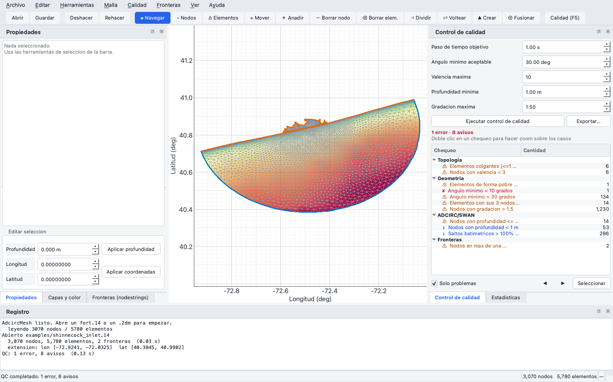
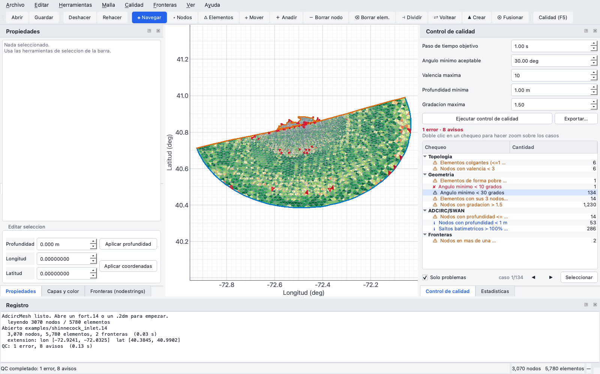
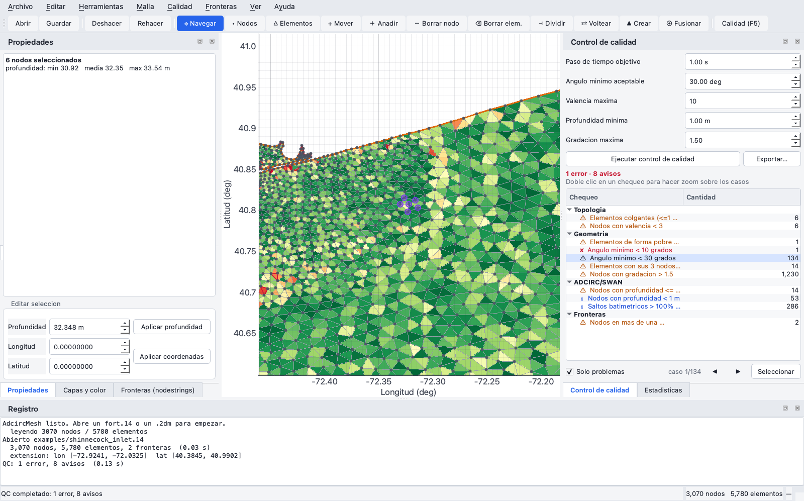

# AdcircMesh

**Visual editor for unstructured meshes with quality control for ADCIRC and SWAN.**

A Python desktop application for hand-editing unstructured triangular meshes and
running the checks that ADCIRC and SWAN require before a model run. It is a free
alternative to the SMS (Aquaveo) workflow for this particular task.



## Installation

```bash
git clone https://github.com/liesvyvall/AdcircMesh.git
cd AdcircMesh
pip install -r requirements.txt
```

Or as an installable package:

```bash
pip install -e .
adcircmesh mesh.14
```

Requires Python ≥ 3.10. Tested on macOS (Apple Silicon); PySide6 and pyqtgraph
work the same on Linux and Windows.

## Usage

```bash
python examples/get_example.py        # download a test mesh
python adcircmesh.py examples/shinnecock_inlet.14
```

The sample mesh is **not bundled in this repository**: it is downloaded on
demand from the [ADCIRC test suite](https://github.com/adcirc/adcirc-testsuite),
which ships without a license file. The `shinnecock_inlet` case (Shinnecock
Inlet, Long Island, New York) is the canonical ADCIRC and coupled ADCIRC+SWAN
example: 3,070 nodes and 5,780 elements.

The interface is in Spanish.

## What it does

### Formats

Reads and writes ADCIRC `fort.14` with its complete sections
(NOPE / NETA / NVDLL / NBOU / NVEL / IBTYPE, including the per-node extra data
of barrier boundaries) and SMS `.2dm`, converting elevation ↔ depth. The round
trip is exact in coordinates, connectivity and boundaries.

### Manual editing

| Key | Tool | What it does |
|---|---|---|
| `Esc` | Navigate | pan and zoom |
| `N` / `E` | Select nodes / elements | click or rubber band; `Shift` adds, `Ctrl` subtracts |
| `M` | Move node | drag with live preview |
| `A` | Add node | splits the element you click into 3, interpolating bathymetry by barycentric coordinates |
| `D` / `X` | Delete node / element | |
| `S` | Split edge | inserts the midpoint and splits the incident elements |
| `F` | Swap edge | checks convexity before applying |
| `C` | Create element | click three nodes |
| `G` | Merge nodes | collapses the second onto the first |

Everything goes through an undo stack: **`Ctrl+Z` / `Ctrl+Shift+Z` revert
anything**, including a full automatic repair as a single step.

### Quality control (`F5`)



34 checks in five families. Each one stores the **offending indices**: selecting
it highlights them on the map, double-clicking zooms to them, and the `◀ ▶`
buttons step through the cases one at a time.

- **Integrity** — out-of-range indices, repeated nodes, duplicate nodes and elements, orphans
- **Topology** — non-manifold edges, non-traversable boundary, disconnected components, dangling elements, valence
- **Geometry** — CW orientation (ADCIRC requires CCW), zero area, slivers, minimum and maximum angle, elements with all three nodes on the boundary, size gradation
- **ADCIRC / SWAN** — CFL violation for a target `dt`, depths ≤ 0 and < −10 m, NaN, abrupt bathymetric jumps between neighbouring nodes
- **Boundaries** — NOPE = 0, out-of-range nodes, declared nodes not on the real border, real border nodes left undeclared, overlaps between nodestrings

Thresholds (time step, minimum angle, valence, depth, gradation) are set in the
panel. The report exports to text.

### Colour by field

Continuous fill by depth, shape quality, minimum or maximum angle, area,
minimum edge, CFL-limited `dt`, gradation or valence, with configurable colormap
and range.

### Repair

**Mesh** menu: weld coincident nodes, remove degenerate, duplicate and
zero-area elements, orient to CCW, keep the largest connected component, make
the boundary traversable, drop dangling elements, fill spurious internal holes,
flip low-quality edges, local Laplacian smoothing that guarantees no element
inverts and lets the coastline slide tangentially, remove boundary slivers,
**renumber with reverse Cuthill-McKee**, and compact. There is also an automatic
pipeline with selectable stages.

RCM renumbering matters more than it sounds: on a 243,315-element mesh of the
Mexican Pacific it cut the bandwidth from 124,609 to 901.

### Boundaries (nodestrings)



A panel lists the boundaries with their type and IBTYPE. They can be generated
automatically (detecting the ocean stretch by depth and edge size, extending it
to the coastline and flagging islands), created from a node selection (ordered
by following the chain of boundary edges), retyped, or deleted.

## Architecture

```
adcircmesh/
  core/          # Qt-free: usable from scripts
    mesh.py      # Mesh class, CPP projection, CSR adjacencies, picking
    meshio.py    # fort.14 and 2dm
    quality.py   # QC engine, returns the offending indices
    edit.py      # reversible editing operations
    repair.py    # global repairs and automatic boundaries
  gui/
    render.py    # pyqtgraph canvas + Agg raster for the fill
    panels.py    # dockable panels
    commands.py  # bridge to Qt's undo stack
    main_window.py
```

The core does not import Qt, so it works headless just as well:

```python
from adcircmesh.core.meshio import load_mesh, save_mesh
from adcircmesh.core.quality import run_qc
from adcircmesh.core import repair

m = load_mesh("mesh.14")
print(repair.renumber_rcm(m))

rep = run_qc(m, dt_target=1.0, min_angle=30.0)
print(rep.n_errors, "errors")
print(rep.by_key("angle_10").ids)      # elements with minimum angle < 10°

save_mesh("out.14", m)
```

### Two decisions that explain the performance

**Nothing is really deleted while editing.** Nodes and elements are flagged dead
and only compacted on save. Indices are never invalidated, so undo is a small
delta instead of a copy of the whole mesh.

**Two drawing engines, because they differ by 400×.** The full wireframe of a
368,000-edge mesh draws in ~25 ms as a single `QPainterPath`; that same path
*filled* takes 10.8 s, because filling hundreds of thousands of subpaths is
pathological for `QPainter`. So colour goes through an off-screen Agg raster
(~0.6 s, debounced) displayed as an image. When you zoom out, edges fall below
2 px and hide themselves; node markers appear only once their on-screen spacing
exceeds 14 px.

## License

MIT — see [LICENSE](LICENSE).

A note on dependencies: **PySide6 is LGPLv3**, not MIT. Used as a dynamically
linked library from Python that is compatible with distributing this code under
MIT, as long as anyone receiving a packaged binary can substitute their own Qt
library. That was one of the reasons for choosing PySide6 over PyQt5, which is
GPL. `pyqtgraph` is MIT; `numpy`, `scipy` and `matplotlib` are BSD.

## Credits

- [ADCIRC](https://adcirc.org) — Luettich (UNC Chapel Hill) and Westerink (Notre Dame)
- [SWAN](https://swanmodel.sourceforge.io) — TU Delft
- Sample mesh: [adcirc/adcirc-testsuite](https://github.com/adcirc/adcirc-testsuite)
